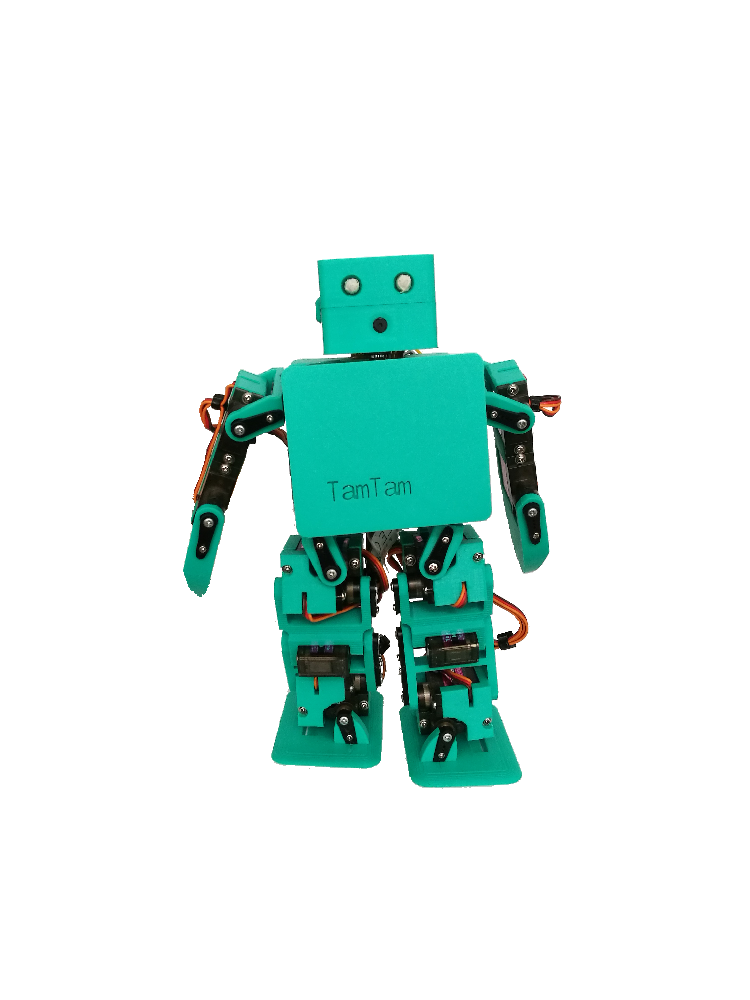

# tamtam
!!!!!!!!!!!!!!!!!!!!!!!!!!!!!!!UNDER CONSTRUCTION!!!!!!!!!!!!!!!!!!!!!!!!!!!!!!
This repo holds Tamtam (an small low-cost humanoid).
It will contain all the documentation needed to build that litte
robot.
It has 19 DOF, those will be mg90s. I expect to finish it very
son. Since now I have done all of the hardware, the electronics are 
working fine and I've already computed the inverse kinematics.

I am working on the code,and there will be also a document explaining
all the details , since this is my degree project.

the robot is 223.25 mm hight

